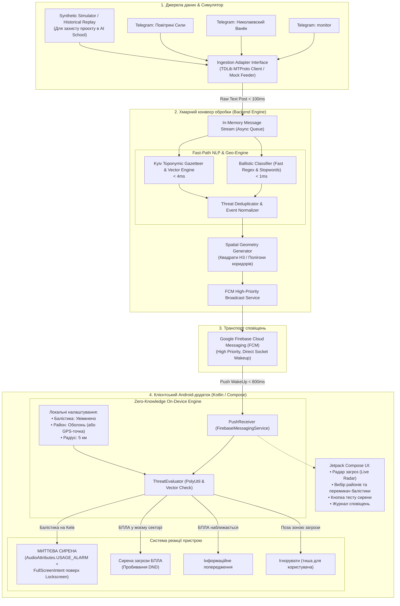

# Технічна специфікація та архітектура системи персоналізованого оповіщення про загрози для Києва

**Проєкт:** Kyiv Threat Alert System (KTAS)  
**Роль проєкту:** Демонстраційний та виробничий прототип для оцінювання в Agentic AI School та подальшого бойового використання.  
**Форм-фактор:** Native Android App (Kotlin / Jetpack Compose) + Хмарний бекенд обробки та розсилки (Python/Go Stream Processor + FCM) + Синтетичне тестове середовище (Simulation Harness).  
**Канал дистрибуції:** Прямий реліз APK через GitHub Releases / Firebase App Distribution.  

---

## 1. Концепція продукту та бізнес-вимоги

### 1.1. Проблематика
1. **Втома від сирен (Alert Fatigue):** Офіційні сирени та додатки оголошують тривогу на рівні всього міста (839 км²) або області. Через транзитні БПЛА за 40 км на південь кияни на півночі ігнорують сирени і не реагують на небезпеку.
2. **Нічний хаос у Telegram:** Мешканці змушені моніторити 5–10 каналів о 3-й ночі, намагаючись зрозуміти сленгові повідомлення (*«2 мопеди на Бровари»*, *«ракета на Васильків/Київ»*).
3. **Критичність часу для балістики:** Час підльоту балістичної ракети («Іскандер-М», «Кинджал») — від 90 до 180 секунд. Будь-яка затримка понад 2–3 секунди позбавляє людей шансу дійти до безпечної кімнати чи укриття.

### 1.2. Класифікація загроз та логіка фільтрації

Система розділяє всі вхідні загрози на дві принципово різні категорії за швидкістю та зоною ураження:

```
                            [Вхідне повідомлення з каналу]
                                          │
                                          ▼
                            [Детектор типу загрози (NLP)]
                                    /           \
                                   /             \
                  [Балістична загроза]         [БПЛА / Шахеди / КАБи]
                           │                              │
                           ▼                              ▼
                 [City-Wide Broadcast]          [Spatial Polygon & Vector]
                 • Локація: Весь Київ            • Сектор: Район або коридор
                 • Без гео-фільтрації            • Радіус: 3 / 5 / 10 / 15 км
                 • Налаштування:                 • Напрямок: курс до користувача
                   [x] Сповіщати про балістику   • Локальний розрахунок на смартфоні
```

1. **Балістичні загрози (Ballistic Missiles: «Іскандер-М», «Кинджал», KN-23):**
   * **Логіка сповіщення:** **Миттєве загальноміське сповіщення (City-wide Broadcast) на весь Київ.**
   * **Географічна фільтрація:** **Вимкнена.** Балістика летить занадто швидко (до 3–4 км/с), а точне місце падіння неможливо визначити до моменту перехоплення.
   * **Налаштування користувача:** Простий незалежний перемикач (Toggle):  
     `[x] Сповіщати мене про загрозу балістики (Так / Ні)`.
   * **Поведінка смартфона:** Найвищий пріоритет (`URGENT_BALLISTIC`), миттєве включення сирени з пробиванням DND та повноекранне сповіщення.

2. **БПЛА / Шахеди / Дрони-камікадзе («Shahed-136», «Гербера»):**
   * **Логіка сповіщення:** **Гіперлокалізована просторова фільтрація (Spatial & Vector Corridor).**
   * **Параметри фільтрації, які налаштовує користувач:**
     * Вибір 1–2 адміністративних районів Києва (наприклад: *Оболонський, Подільський*).
     * АБО закріплена гео-точка («Дім», «Офіс») з радіусом реагування (3 км, 5 км, 10 км, 15 км).
     * Векторна фільтрація: реагувати, тільки якщо об'єкт рухається **в напрямку** цільового району / точки.
   * **Поведінка смартфона:**
     * *Критична небезпека (ціль входить у радіус):* звукова сирена (`USAGE_ALARM`).
     * *Попередження (ціль за 10–15 км курсом на район):* м'який короткий сигнал.
     * *Поза зоною (ціль в іншому кінці міста):* повна тиша, пристрій не турбує людину.

3. **Локальний відбій («Чисто»):**
   * Фіксація повідомлень про збиття, локаційну втрату або вихід цілей за межі сектору.
   * Надсилання тихого повідомлення: *«Небезпека для вашого району минула»*, що дозволяє людям повернутися до сну без очікування офіційного відбою по всій Київській області.

---

## 2. Архітектура системи (System Architecture)

Система реалізована за стандартом **Zero-Knowledge Privacy Architecture**: сервер обробляє канали та генерує геометрію загрози, транслюючи її через FCM, а кінцевий смартфон виконує просторовий розрахунок локально.

### 2.1. Загальна схема компонентів



---

## 3. Деталізація компонентів бекенду

### 3.1. Ingestion Layer та Mock Feeder
Для забезпечення автономності тестування та виконання дедлайну для Agentic AI School розробляється інтерфейс `ThreatStreamProvider`:
1. **TDLib Provider (Production):** Слухає реальні Telegram-канали через офіційний протокол MTProto (бібліотека `python-tdlib` або `Telethon`).
2. **Synthetic Mock Provider (Testing & Demo):** Модуль для емуляції потоку подій, що завантажує тестовий датасет історичних постів і транслює їх з керованими таймінгами (real-time playback).

### 3.2. NLP & Топонімічний Газетир Києва (Kyiv Spatial Gazetteer)
Час обробки тексту має становити **менше 5 мілісекунд**, щоб не втрачати секунди на мережеві запити до сторонніх важких LLM.

* **Класифікатор балістики:**
  * Патерни: `(балістик[аиу]|іскандер|кинджал|kn-23|швидкісна ціль|загроза балістики)\b.*?(київ|столиц[яі]|київщин[аи])`
  * Стоп-слова: `(відбій|чисто|локаційно втрачено|не підтверджено)`
* **Газетир районів Києва та орієнтирів:**
  * Райони: `Оболонський (Оболонь)`, `Печерський`, `Подільський (Поділ, Куренівка)`, `Шевченківський (Лук'янівка, Сирець)`, `Солом'янський (Відрадний, Жуляни)`, `Голосіївський (Теремки)`, `Святошинський (Борщагівка, Академмістечко)`, `Дарницький (Позняки, Осокорки)`, `Дніпровський (Русанівка, Воскресенка)`, `Деснянський (Троєщина, Лісовий)`.
  * Буферні передмістя (вхідні коридори): `Вишгород, Бровари, Бориспіль, Васильків, Обухів, Ірпінь, Буча, Глеваха, Хотянівка, Козин`.
* **Векторний парсер напрямків:**
  * `(курс|напрямок|вектор|повз|через|на)\s+([А-Яа-яіїєґ\s\-]+)`

### 3.3. Канонічна модель загрози (Threat Event Schema)
```json
{
  "event_id": "evt_20261005_154001",
  "threat_type": "BALLISTIC | UAV_SHAHED | CRUISE_MISSILE | ALL_CLEAR",
  "scope": "CITY_WIDE | SPATIAL_POLYGON",
  "urgency": "CRITICAL | WARNING | INFO",
  "title": "Загроза балістики: Київ!",
  "description": "Зафіксовано пуск балістики в напрямку столиці. Негайно в укриття!",
  "target_districts": ["ALL"] or ["Obolon", "Podil"],
  "vector_bearing_deg": 225,
  "corridor_polygon": [
    [50.485, 30.450],
    [50.530, 30.520],
    [50.510, 30.600],
    [50.470, 30.510]
  ],
  "source_channel": "@monitor_war",
  "timestamp_utc": 1791207600
}
```

---

## 4. Деталізація клієнтської частини (Android Application)

### 4.1. Архітектурний стек Android
* **Мова & UI:** Kotlin, Jetpack Compose, Material Design 3.
* **Архітектура:** Clean Architecture + MVVM / MVI.
* **Фонова робота:** `FirebaseMessagingService` з пріоритетом WakeLock.
* **Локальне сховище:** DataStore Preferences (налаштування зон та балістики), Room (історія повідомлень).
* **Геометрія:** Google Maps Android Geometry Utility (`PolyUtil`) для швидкого визначення `PolyUtil.containsLocation()`.

### 4.2. Налаштування сповіщень та обхід DND (Do Not Disturb)
Для того, щоб розбудити користувача о 03:00 ночі при вимкненому звуку смартфона:
1. Використання каналу сповіщень з пріоритетом `NotificationManager.IMPORTANCE_HIGH` або `MAX`.
2. Прив'язка звуку до апаратного аудіопотоку `AudioAttributes.USAGE_ALARM`.
3. Запит дозволу `setBypassDnd(true)` під час первинного налаштування.
4. Додавання `FullScreenIntent` — підняття екрана тривоги поверх заблокованого екрана смартфона (як вхідний телефонний виклик).

### 4.3. Екрани інтерфейсу (Jetpack Compose)
1. **Головний екран (Threat Radar Dashboard):**
   * Поточний статус Києва (Тривога / Відбій).
   * Статус вашого району (Зелений: Спокійно / Жовтий: Наближення / Червоний: Загроза).
   * Індикатор загрози балістики.
2. **Екран фільтрів та налаштувань:**
   * **Секція «Балістика»:**
     * Перемикач `[x] Сповіщати про балістику по Києву` (за замовчуванням увімкнено).
   * **Секція «БПЛА та ракети»:**
     * Вибір режиму: «Мій район» або «Вказати точку на карті + Радіус (км)».
     * Список чекбоксів районів Києва.
     * Повзунок радіуса: 3 км — 5 км — 10 км — 15 км.
     * Перемикач: `[x] Враховувати напрямок руху (не сповіщати, якщо летить в інший бік)`.
3. **Екран тестування (Audio Test):**
   * Кнопка *«Перевірити гучність сирени»* для перевірки пробивання беззвучного режиму.
4. **Журнал подій (Threat Feed):**
   * Хронологічний список усіх зафіксованих подій із джерелами та часом.

---

## 5. Середовище синтетичного тестування (Simulation Harness для AI School)

Оскільки дедлайн здачі проєкту сьогодні, неможливо чекати реальної атаки на Київ для демонстрації працездатності. Система повинна мати **повністю готовий синтетичний тестовий контур**.

### 5.1. Структура тестового стенду
Створюється окремий модуль `simulator/`, який включає:
1. **Історичний датасет (`test_dataset.json`):**
   * 15 реальних повідомлень з Telegram-каналів за попередні періоди:
     * *Кейс 1 (Балістика):* "Київ — загроза балістики з Брянщини!", "Швидкісна ціль на Київ!".
     * *Кейс 2 (БПЛА, Оболонь):* "Шахед з Вишгорода курсом на Оболонь".
     * *Кейс 3 (БПЛА, Лівий берег):* "2 БПЛА через Бровари на Дарницький район".
     * *Кейс 4 (Транзит, не стосується центру):* "БПЛА на півдні Київщини, курс на Білу Церкву".
     * *Кейс 5 (Локальний відбій):* "Оболонь — чисто, ціль збито".
     * *Кейс 6 (Загальний відбій):* "Відбій загрози по місту Києву".
2. **Скрипт відтворення (`run_simulation.py`):**
   * Надсилає ці повідомлення у тестовий канал або напряму в конвеєр обробки з інтервалом у 2–3 секунди.
   * Вимірює затримку обробки (Latency) кожного етапу.
   * Фіксує результати геофільтрації для двох віртуальних користувачів:
     * *Користувач А (Оболонь):* має отримати сирену для Кейсу 1, Кейсу 2, тихий сигнал для Кейсу 5 і **жодного звуку** для Кейсу 3 і 4!
     * *Користувач Б (Позняки):* має отримати сирену для Кейсу 1, Кейсу 3 і **жодного звуку** для Кейсу 2!

### 5.2. Критерії успішності перевірки (Verification Criteria)
* **Latency парсингу:** менше 5 мс на повідомлення.
* **Точність класифікації балістики:** 100% (нуль пропусків).
* **Ізоляція районів:** Повідомлення про загрозу над Оболонню не викликає спрацювання сирени у мешканця Позняків.
* **Підтвердження сповіщення:** Лог-запис у клієнті зі статусом `TRIGGERED_ALARM` або `DROPPED_OUT_OF_ZONE`.

---

## 6. Стратегія дистрибуції (Direct APK & GitHub Releases)

Згідно з вимогою швидкого поширення в обхід модерації Google Play:
1. **GitHub Actions CI/CD:**
   * Автоматична збірка релизного APK при пуші тегу версії (`v1.0.0-mvp`).
   * Підпис APK релізним ключем (Keystore через GitHub Secrets).
   * Автоматичне створення GitHub Release та прикріплення файлу `app-release.apk`.
2. **Firebase App Distribution (Альтернатива):**
   * Завантаження тестового білда для команди через Firebase CLI для зручного встановлення тестувальниками в один клік.

---

## 7. Відповідність вимогам та готовність до створення плану імплементації

Дана специфікація повністю враховує:
* Вибір **Варіанту 1 (Native Android + Cloud Backend + Zero-Knowledge)**.
* **Балістику:** Глобальне сповіщення на весь Київ без гео-фільтрації + окремий користувацький перемикач.
* **Пряме поширення через APK / GitHub Releases**.
* **Синтетичне тестове середовище з історичними повідомленнями** для успішної та переконливої демонстрації проєкту на Agentic AI School сьогодні.
